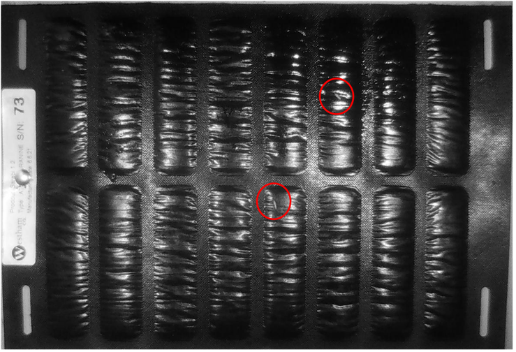
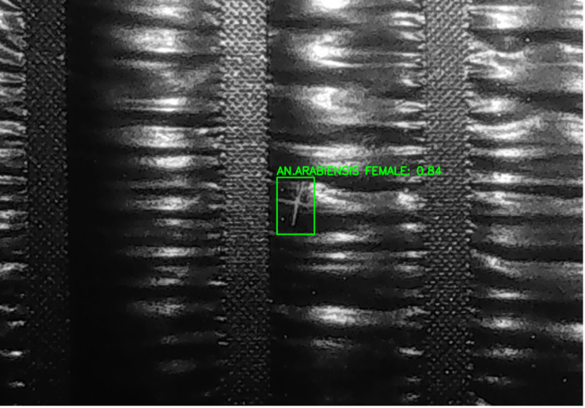

# Mosquito Detection and Classification Using Deep Learning
## Master's Thesis by Juval Gutknecht

__*Original Title: Deep Learning for Automatization of Video-Analysis for Malaria Vector Behavioral Studies*__

Department of Biomedical Engineering, University of Basel\
Center for Medical Image Analysis and Navigation (CIAN)


Malaria is caused by a parasite that is transmitted through the bite of infected mosquitoes. In 2022, about 249 million cases of malaria were recorded. If untreated, malaria can cause death, and this happened to 608’000 people in 2022 (1). Most of them were children in sub-Saharan Africa, where treatment is not readily available. The goal of this master thesis was to develop a series of Deep Learning models to support mosquito behavioral studies and vector control strategies, particularly through the use of attractive toxic sugar baits (ATSB). These baits attract mosquitoes, which consume the toxic sugar, fly off, and ultimately die due to the mosquitocidal properties of the ingested solution (2). The data consisted of 24-hour series of images of the ATSBs taken every minute in daylight and infrared mode and labels indicating whether mosquitoes were present, and if so what their gender and species were. Using this data, a series of models were trained to solve two tasks: mosquito detection and mosquito classification. First, an Inception-ResNet-v2 was deployed as a binary classifier on the pre-processed image series, which included an extra background subtracted channel. The resulting model achieved F1 scores up to 0.93 on the test set. For the second task, the background-subtracted images were employed to generate bounding box labels. This enabled the training of a YOLOv8 model for insect detection. Its training was successful, as it reached F1 scores up to 0.83 on the test set. Finally, a second YOLOv8 model was developed that could tackle both the mosquito detection and species and sex classification tasks. This last model reached F1 scores of up to 0.9. This limited performance might be due to the small size of the dataset (126 images, highest class 109 instances, lowest class 3 instances). The results of all the models are promising for the automation of ATSB monitoring. However, to achieve better and more generalized models, larger labeled datasets are required.

### Data and Methods

**Dataset: 24-hour image series of ATSBs**

- Captured every minute in daylight and infrared mode
- Labels for mosquito presence, gender, and species
- 126 images total (109 instances in highest class, 3 in lowest)


**Models Developed:**

- Inception-ResNet-v2 binary classifier (F1 score: 0.93)
- YOLOv8 insect detection model (F1 score: 0.83)
- YOLOv8 combined detection and classification model (F1 score: 0.9)

\
Figure 1: Sample image of an Attractive Toxic Sugar Bait with two mosquitoes on it. These images were used to train the models used in this thesis. (Picture: SwissTPH, Tenywa Frank).

\
Figure 2: A resulting output of the working YOLOv8m algorithm that detects mosquito species and sex. (Picture: Juval Gutknecht).

### Supervision:

Prof. Philippe C. Cattin\
philippe.cattin@unibas.ch\
CIAN

Dr. Julia Wolleb\
julia.wolleb@unibas.ch\
CIAN

Natalia Mañas Chavernas\
natalia.manaschavernas@unibas.ch\
CIAN


**References:**\
(1) Fact sheet about malaria, en. [Online]. Available: https://www.who.int/news-room/fact-sheets/detail/malaria (visited on 04/11/2024).\
(2) Tenywa, F.C., Kambagha, A., Saddler, A. et al. The development of an ivermectin-based attractive toxic sugar bait (ATSB) to target Anopheles arabiensis . Malar J 16, 338 (2017). https://doi.org/10.1186/s12936-017-1994-6

# How to use the Inception-ResNet-v2 pipeline:

## Pre-Processing: (Datahandler folder)
1. **Optional: find IR-images (1_Find_IR_Images.py)**: if only the IR-Images wanted to be used for the model.
2. **Crop ATSB (2_Gluetrap_Cropper.py)**: To cut away all the space that isn’t needed for the training of the model
3. **Resizing the images (3_resize_images_torch_batch.py)**: 30 megapixel images were too large for the Inception-ResNet-v2 model to handle, so the images were resized to one third of the original size. Additionally, it was easier to handle for the following algorithms.
4. **Background subtraction (4_ImageSubtraction_OOP_median_batchwise.py or 4_ImageSubtraction_running_average_median.py)**: this algorithm aims to remove the background to improve mosquito visibility so the model can detect it more easily. When implemented, the mosquitoes appear as white blobs on a black background.
5. **Global normalization (5_GlobalNormalizer.py)**: if normalization (that is changing the light intensities from [0, 255] to [0, 1]) were to be done for each image individually, the black background would regain contrast, which defeats the purpose of this action.
6. **Renaming of files and separating in class folders (6_RenameAndPopulate_v0.py)**: the model wants a folder of positive and a folder of negative images, so the dataloader can separate the items while loading.

## Using the binary classifier model: (Model folder)
**dataloader.py**
- Change the folder names in the dataloader file
- If necessary, change `num_workers`

**training.py**
- Set the `run_dir`, where the model saves all the data for TensorBoard and the model weights (`best_model.pt`).
- If necessary, change the `device`, `lr` (learning rate), epochs, model name, set a `checkpoint_dir`.
- Run the code in the terminal (preferably using tmux)
- Start a TensorBoard on the predefined `run_dir`
- Wait for the model to finish train.

**inference.py**
- Set the `experiment_folder`, where the `best_model.pt` is saved, set the device you want to use.
- Run the `inference.py` code
- The inference results are then saved in the experiment folder under `experiment_folder/inference`, including the following:
  - Metrics in form of an excel table
  - Selected samples displaying prediction with plain image, background subtracted image and a saliency map of the same image
  - Confusion matrices of the training, validation and test set

# How to use the YOLOv8 pipeline:

## Pre-processing:
- (If necessary) generate bounding box labels to dataset and save them in the YOLO format: (if background subtracted images are available, use `/AutomaticBoundingBoxCreator/boundingbox_v1.py` for preliminary bounding boxes)
  - `.txt`-file that has the name of the image.
  - `<numeric label (0, 1, …)> <relative x-coord bounding box> <relative y-coord middle of bounding box> <relative heights> <relative width>`
    - i.e. `02230782.txt`: `0 0.304579 0.195328 0.017333 0.046720`
- Save the images in a folder and save the labels in a folder.
- Use the program `split_and_distribute.py` to randomly split the data into training (70%), validation (15%) and test set (15%)
- Adapt the `data.yaml` file to your needs

## Training the YOLO-Model
**Yolo_mosquito-detector_train.py**
- Set image folder
- Set labels folder
- Set `data.yaml` filepath 
- Change the parameters if necessary
- Run the program over the terminal
- All the values will be saved in a `runs/train` folder, including validation results, plots and the best model weights.

## Running the trained YOLO-Model
To do: Depending on the data to be analysed (image folder or video), choose the appropriate inference file and specify the path and model and run the program.

# Folder structure
```
root
├── Inception-ResNet-v2
│   ├── Pre-processing
│   │   ├── 0_Find_IR_Images.py
│   │   ├── 1_Crop_ATSB.py
│   │   ├── 2_Resize_Images.py
│   │   ├── 3_Bg_Sub_batchwise.py or 3_Bg_Sub_window.py
│   │   ├── 4_Global_Normalizer.py
│   │   ├── 5_Rename_and_Distribute.py
│   ├── Model
│   │   ├── Dataloader.py
│   │   ├── Training.py
│   │   ├── Inference.py
│   │   ├── Inception-ResNet-v2-BigInput.py
│   ├── Utils
│   │   ├── Bar_Plot_Model_Comparison.py
│   │   └── F1-Curve_Plotter.py
├── YOLOv8
│   ├── Pre-processing
│   │   ├── 0_Preliminary_BBox.py
│   │   ├── 0_YOLO__labels_from_xlsx.py
│   │   ├── 1_Sync_Labels_to_Images.py
│   │   ├── 2_Split_and_Distribute_files.py
│   ├── Model
│   │   ├── data_mosquito_or_other_insect.yaml
│   │   ├── data_mosquito_pos_inverted.yaml
│   │   ├── data_mosquito_pos_neg_bb.yaml
│   │   ├── data_only_mosquito_bb.yaml
│   │   ├── data_species_sex.yaml
│   │   ├── YOLOv8-Mosquito-Trainer.py
│   │   ├── YOLOv8-Mosquito_inference_image_folder.py
│   │   ├── YOLOv8-Mosquito_inference_video.py
│   ├── Utils
│   │   ├── YOLO_Plots.py
│   │   ├── YOLO_Class_Changer.py
│   │   ├── move_predifined_number_of_files.py
│   │   ├── Renamer.py
│   │   ├── sync_img_and_label.py
│   │   ├── color_inverter.py
│   │   └── YOLO_Class_Counter.py
└── Data
    ├── ATSB_camera_1
    │   ├── labels.xlsx
    │   └── original_images
    ├── ATSB_camera_2
    │   ├── labels.xlsx
    │   └── original_images
    ├── ATSB_combined
    │   └── ReadMe.md
    ├── YOLO-insect_detection
    │   ├── all_labels_only_mosquito
    │   ├── all_labels_mosquito_or_other_insect
    │   └── all_positive_images
    └── species_and_sex
        ├── images
        ├── labels_only_positive
        └── labels_species_sex
```